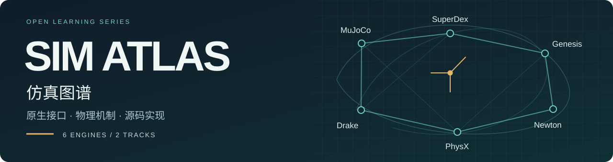

**学会使用仿真器，也能解释它为什么这样工作。**

[English](README.en.md) · [选择学习路线](docs/learning-paths.md) · [共同基础](docs/foundations.md) · [开发看板](https://github.com/users/huangkiki/projects/2) · [实验案例](docs/dexlab.md)

Sim Atlas · 仿真图谱是一套独立社区课程，覆盖 **MuJoCo、SuperDex、Genesis、Newton Physics、PhysX、Drake**。每个引擎有自己的学习仓库，沿原生 API 理解模型、状态、控制和观测，再进入动力学、接触、求解器与源码。

这里组织阅读顺序；各引擎仓库维护详细课程；[GitHub Projects](https://github.com/users/huangkiki/projects/2) 管理任务；[DexLab](https://github.com/huangkiki/Dexlab) 保存实验协议、案例与证据。

## 你想从哪里开始？

| **A · 使用仿真器** | **B · 理解物理与源码** |
|---|---|
| 从模型和第一个原生接口开始，学会组织机器人、控制、传感器和数据。 | 从状态和方程开始，追踪一次步进中的碰撞、约束、求解与积分。 |
| 对象与安装 → 建模 → 状态与时间 → 驱动与机器人 → 传感器 → 批量与数据 | 数据结构 → 动力学流水线 → 接触模型 → 求解器 → 数值积分 → 力观测与扩展 |
| 阅读前准备 Python/C++ 基础；遇到物理概念时回到共同基础。 | 阅读前准备线性代数、刚体力学，并先熟悉所选引擎的 A0–A4。 |
| [查看 A0–A9 路线](docs/learning-paths.md#应用路线-a) | [查看 B0–B7 路线](docs/learning-paths.md#原理与源码路线-b) |

两条路线共享同一个引擎仓库，可以交叉阅读。先选一个引擎沿主线走通，再对照其他引擎的原生实现。

## 选择一个引擎

这些入口按学习对象组织，方便找到兴趣所在；实验比较另按 DexLab 的版本和工况阅读。

| 引擎 | 原生学习重点 | 课程入口 |
|---|---|---|
| **[MuJoCo](https://github.com/huangkiki/mujoco-atlas)** | MJCF、`mjSpec/mjModel/mjData`、驱动器、约束与积分流水线 | [完整目录](https://github.com/huangkiki/mujoco-atlas/blob/main/docs/curriculum.md) · [E5 批量与数据](https://github.com/huangkiki/mujoco-atlas/blob/main/docs/cpu-batching.md) |
| **[SuperDex](https://github.com/huangkiki/superdex-atlas)** | Physics / Robotics 的分工、Scene / Actor、接触几何与隐式求解 | [完整目录](https://github.com/huangkiki/superdex-atlas/blob/main/docs/curriculum.md) · [E5 批量与数据](https://github.com/huangkiki/superdex-atlas/blob/main/docs/batch-learning-data.md) |
| **[Genesis](https://github.com/huangkiki/genesis-atlas)** | Scene / Entity、多物理求解器、批量状态、控制与可微边界 | [完整目录](https://github.com/huangkiki/genesis-atlas/blob/main/docs/curriculum.md) · [E5 批量与数据](https://github.com/huangkiki/genesis-atlas/blob/main/docs/batch-learning-data.md) |
| **[Newton Physics](https://github.com/huangkiki/newton-atlas)** | ModelBuilder / State / Control、Warp 数组、不同 Solver 的能力边界 | [完整目录](https://github.com/huangkiki/newton-atlas/blob/main/docs/curriculum.md) · [E4 传感与渲染](https://github.com/huangkiki/newton-atlas/blob/main/docs/sensors-rendering.md) |
| **[PhysX](https://github.com/huangkiki/physx-atlas)** | C++ SDK、Scene / Actor / Shape、articulation、PGS / TGS 与宿主接入 | [完整目录](https://github.com/huangkiki/physx-atlas/blob/main/docs/curriculum.md) · [E4 查询与传感](https://github.com/huangkiki/physx-atlas/blob/main/docs/sensors-rendering.md) |
| **[Drake](https://github.com/huangkiki/drake-atlas)** | Systems / Diagram / Context、MultibodyPlant、SceneGraph、接触与优化 | [完整目录](https://github.com/huangkiki/drake-atlas/blob/main/docs/curriculum.md) · [E4 相机与传感](https://github.com/huangkiki/drake-atlas/blob/main/docs/sensors-rendering.md) |

六个引擎均已发布 E0–E4：导读、建模与状态、驱动与机器人、接触与求解、传感与渲染。MuJoCo、SuperDex、Genesis 另已发布 E5 批量、学习接口与数据专题；Newton、PhysX、Drake 的 E5 正在开发。各引擎入口包含固定版本、官方源码与阅读状态。教程的源码版本、安装包身份和 DexLab 实测版本分别记录。

## 建立共同基础

学习每个引擎时，反复带着六个问题读代码：

1. **模型表达了什么？** 单位、坐标轴、几何、质量与惯量分别来自哪里？
2. **谁拥有状态？** 配置、速度、输入、派生量和求解缓存如何区分？
3. **谁推进时间？** 控制周期、物理步长、内部子步与显示刷新怎样配合？
4. **接触怎样产生作用？** 碰撞几何、接触律、材料组合和约束近似分别是什么？
5. **数值问题怎样解？** 方程、残差、迭代预算、终止条件与积分更新如何关联？
6. **观测在什么时刻有效？** 返回的是力、冲量、控制输入还是显示结果，坐标与采样阶段是什么？

[共同基础地图](docs/foundations.md) 给出术语、最小公式与各仓的对应章节入口。具体字段、默认值和支持限制在引擎课程中展开。

## 学习进度与参与方式

目前六仓均已发布 E0–E4，前三仓完成 E5；其余 E5、特色扩展及双路线审校继续推进。**“路线完整规划”与“章节已经完成”分别标注。** 示例逐项说明源码核对、语法检查和实际执行状态。

| 阶段 | 交付内容 |
|---|---|
| E0 | 导读、双路线目录、固定源码地图 |
| E1–E2 | 建模、状态与时间；驱动、机器人和任务接口 |
| E3–E4 | 接触、求解器、积分与力观测；传感器与渲染 |
| E5–E6 | 批量、学习接口与数据；引擎特色、扩展与限制 |
| E7 | 两条路线逐单元审校、来源核对与 DexLab 案例衔接 |

[开发看板](https://github.com/users/huangkiki/projects/2/views/2) · [课程任务表](https://github.com/users/huangkiki/projects/2/views/3) · [如何贡献](CONTRIBUTING.md)

引擎专题的修改和问题在对应仓库讨论；本仓维护导航、共同术语与课程衔接。每交付一项，核对当前提交的内容与检查结果，重新审视剩余依赖，再决定下一项。

## 从机制走向证据

学会解释引擎以后，可以带着具体问题阅读 [DexLab](https://github.com/huangkiki/Dexlab)：如何对齐工况，怎样区分控制命令与接触观测，哪些结论只在给定版本、模型和协议下成立。

当前课程阶段专注引擎知识与源码；实验后续复用 DexLab。已有报告的覆盖范围、失败和未准入引擎均保留原记录。[查看案例与阅读边界](docs/dexlab.md)。

---

独立社区学习项目，与各引擎官方项目无隶属关系。原创课程和图形采用 [Apache-2.0](LICENSE)；上游源码与资产遵守各自许可。[来源与许可](THIRD_PARTY.md)
